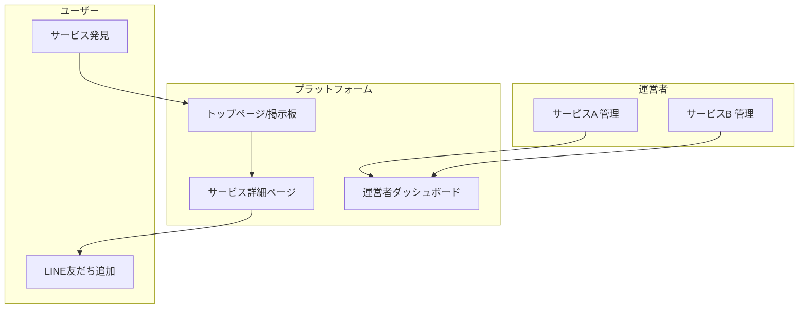
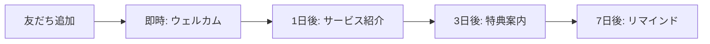
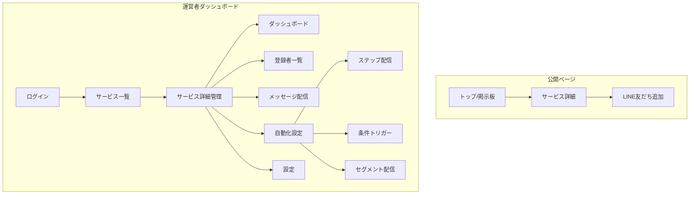
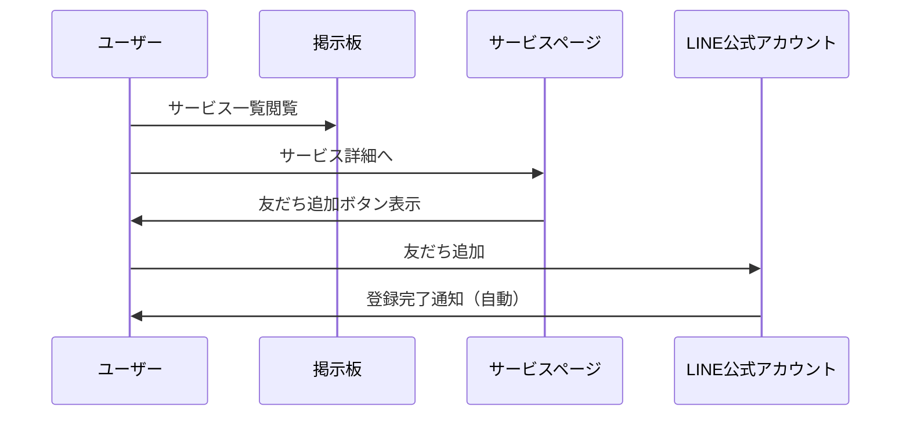

# LINE Waiting List アプリ 仕様書

## 概要

新しいWebサービスを立ち上げる際に、LINEを活用したウェイティングリスト（事前登録）を簡単に作成・管理できるプラットフォーム。

従来のメール登録型と異なり、LINE友だち追加による登録で、そのままLINEを通じた販促・通知が可能。さらにメッセージ配信の自動化により、手間なくユーザーエンゲージメントを維持できる。

**掲示板機能**により、プラットフォーム上のサービス一覧を閲覧でき、ユーザーは興味のあるサービスを発見・登録できる。

## コンセプト

- **簡単登録**: LINEの友だち追加ボタンをタップするだけで登録完了
- **高い開封率**: メールより圧倒的に高いLINEの開封率を活用
- **即時性**: サービスローンチ時に即座にLINEで通知可能
- **自動化**: ステップ配信・条件トリガーで手間なく販促
- **発見**: 掲示板でユーザーが新しいサービスを見つけられる
- **双方向コミュニケーション**: 登録者からの問い合わせにも対応可能

## ターゲットユーザー

### サービス運営者
- 新規サービスのローンチ前にユーザーを集めたいスタートアップ/個人開発者
- LINEを活用したマーケティングを行いたい事業者
- プロダクトの需要検証を行いたい企画者

### 一般ユーザー
- 新しいサービスを早く知りたい人
- 先行登録特典を得たい人

## サービス構成図



## 機能要件

### 1. 掲示板（サービス一覧）

#### 1.1 トップページ
- 公開中のサービス一覧表示
- カード形式でサービス情報を表示
  - サムネイル画像
  - サービス名
  - 説明文（抜粋）
  - カテゴリ
  - 登録者数
  - ローンチ予定日
- ソート機能（新着順、人気順、ローンチ予定日順）
- カテゴリフィルター
- 検索機能

#### 1.2 カテゴリ
- テクノロジー / AI
- EC / マーケットプレイス
- フィンテック
- ヘルスケア
- エンタメ / ゲーム
- 教育
- ライフスタイル
- その他

#### 1.3 サービス詳細ページ
- サービス概要
- 特徴・メリット
- ローンチ予定日
- 運営者情報
- 現在の登録者数
- LINE友だち追加ボタン / QRコード
- SNSシェアボタン

### 2. サービス個別ページ（公開側）

#### 2.1 登録導線
- サービス説明
- LINE友だち追加ボタン（LINEアプリへ遷移）
- QRコード表示（PC向け）
- 登録するメリットの訴求

#### 2.2 紹介システム（リファラル）
- 各登録者にユニークな紹介URLを発行
- 紹介経由で登録があった場合、紹介者の順位を上げる
- LINEで紹介URLをシェアしやすいUI

### 3. LINE Bot（登録者向け）

#### 3.1 自動応答
- 友だち追加時の自動ウェルカムメッセージ
- 現在の順位確認コマンド
- 紹介URL取得コマンド

#### 3.2 リッチメニュー
- 順位確認ボタン
- 紹介URLコピーボタン
- サービス詳細ボタン

### 4. 運営者向け機能

#### 4.1 サービス登録・編集
- サービス基本情報
  - サービス名
  - 説明文（短い / 詳細）
  - カテゴリ選択
  - サムネイル画像
  - ローンチ予定日
- LINE公式アカウント連携設定
- ランディングページカスタマイズ
  - テーマカラー
  - ロゴ画像
- 公開/非公開設定
- 掲示板への掲載ON/OFF

#### 4.2 ダッシュボード
- 総登録者数（LINE友だち数）
- 本日の登録者数
- 週間/月間の登録推移グラフ
- ブロック率
- 掲示板からの流入数

#### 4.3 登録者一覧
- 登録者リスト（LINE表示名、登録日時、順位、紹介数、ブロック状態）
- CSVエクスポート機能
- フィルター機能（アクティブ/ブロック済み）

#### 4.4 メッセージ配信
- 一斉配信（全員/セグメント別）
- 配信予約
- テンプレート管理
- 配信履歴・開封率確認

#### 4.5 設定
- LINE公式アカウント連携設定
- 紹介機能のON/OFF
- 順位上昇ルールの設定
- 自動応答メッセージの編集

### 5. メッセージ自動化機能

#### 5.1 ステップ配信（シーケンス）
登録からの経過時間に応じて自動でメッセージを配信



設定項目:
- ステップ名
- 配信タイミング（登録から○日後 / ○時間後）
- 配信時刻（例: 10:00〜12:00 の間に配信）
- メッセージ内容
- 有効/無効切り替え

#### 5.2 条件トリガー配信
特定の条件を満たした時に自動でメッセージを配信

| トリガー | 配信例 |
|---------|--------|
| 紹介成功時 | 「紹介ありがとう！順位が上がりました」 |
| 順位が○位以内になった時 | 「もうすぐご案内できます！」 |
| 登録者数が○人達成時 | 「○人突破しました！」 |
| 特定日時 | ローンチ日のカウントダウン |

#### 5.3 セグメント自動配信
条件に合致するユーザーグループへの定期配信

セグメント条件:
- 順位（上位○%、○位以内）
- 紹介数（○人以上紹介）
- 登録日（○日以内の新規）
- アクティブ状態

#### 5.4 自動化ダッシュボード
- 稼働中の自動化一覧
- 各自動化の配信実績
- 配信成功率・エラー率
- 自動化のON/OFF切り替え

### 6. プラットフォーム管理（運営者向け）

#### 6.1 運営者アカウント
- サインアップ / ログイン
- プロフィール編集
- 利用状況・請求確認

#### 6.2 料金モデル

**完全従量課金制** - 無料プランなし、使った分だけ

| 項目 | 料金 |
|------|------|
| 初期費用 | 無料 |
| 月額基本料 | 無料 |
| LINE送信手数料 | **送信料の10%** |

**料金例**
| 月間送信数 | LINE送信料（税別） | 手数料（10%） |
|-----------|-------------------|---------------|
| 1,000通 | 約3,000円 | 約300円 |
| 5,000通 | 約15,000円 | 約1,500円 |
| 10,000通 | 約30,000円 | 約3,000円 |

**特徴**
- 無料プランなし（全員同じ条件）
- 初期コストゼロで即日ローンチ可能
- 使った分だけの支払い
- 登録者数・機能の制限なし
- セットアップガイド付きで誰でも簡単に開始

**クレジットカード登録タイミング**

初回メッセージ送信時に要求

```
サインアップ（無料）
    ↓
サービス作成・LINE連携
    ↓
登録者が集まる（ここまで完全無料）
    ↓
初めてメッセージ送信しようとした時
    ↓
クレカ登録を要求
    ↓
送信実行
```

→ 登録者がいる状態で「送りたいのに送れない」を避けたい心理を活用

## 画面構成



## LINE連携の仕組み



## MVP（最小構成）

Phase 1として以下の機能を優先実装:

1. **掲示板（サービス一覧）**
2. サービス詳細ページ（LINE友だち追加ボタン + QRコード）
3. 運営者サインアップ / ログイン
4. サービス登録・編集
5. LINE Webhook受信 + 自動ウェルカムメッセージ
6. 管理画面（登録者一覧 + CSVエクスポート）
7. シンプルなダッシュボード（総登録者数）
8. 簡易メッセージ一斉配信
9. 基本的なステップ配信（3ステップまで）

## LINE公式アカウント準備

各サービス運営者は以下の準備が必要:

1. LINE Developersアカウント作成
2. Messaging APIチャネル作成
3. Webhook URL設定（プラットフォームが提供するURLを設定）
4. チャネルアクセストークン発行

## 今後の拡張候補

- 掲示板のランキング機能
- おすすめサービスのレコメンド
- 複数LINE公式アカウント管理
- セグメント配信（順位上位者のみ等）
- リッチメッセージ（画像・ボタン付き）配信
- Flex Message対応
- LINE LIFF（LINEアプリ内Webページ）
- 分析機能強化（離脱分析等）
- A/Bテスト（メッセージ内容の比較）
- Webhook連携（Zapier、Slack等）
- AIによるメッセージ最適化提案
- 運営者同士のコミュニティ機能
